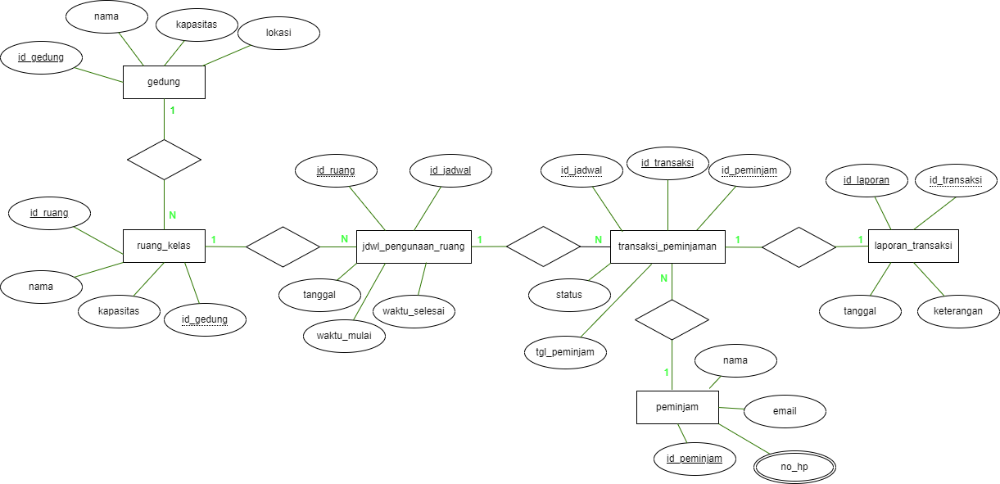

## **Kelompok 7**

```
1. DIPCA ANUGRAH
2. DISKA KURNIA AZZAHRA PUTRA
3. MUHAMMAD RIYADUS SOLIHIN
4. DIMAS ADI NUGRAHA
```

## DAFTAR ISI

| Menu     | Link                                                |
| -------- | --------------------------------------------------- |
| ER-D     | [link](#er-d)                                       |
| DDL      | [link](#ddl-script)                                 |
| SQL CRUD | [link](#sql-crud-script)                            |
| SQL JOIN | [link](#sql-join-script)                            |
| LAPORAN  | [link](#laporan)                                    |
| YouTube  | [link](https://www.youtube.com/watch?v=4BXCUde8YAA) |

# DATABASE SISTEM PEMINJAMAN RUANG KELAS

- Mengelola data Gedung dan Ruang Kelas
- Mengelola Jadwal Penggunaan Ruang
- Mengelola Data Peminjam
- Transaksi Peminjaman
- Laporan Transaksi

## **ER-D**



[BACK->DAFTAR_ISI](#daftar-isi)

## **DDL Script**

```sql
SHOW DATABASES;
```

```sql
CREATE DATABASE peminjaman_ruang_kelas;
```

```sql
USE peminjaman_ruang_kelas;
```

```sql
SHOW TABLES;
```

```sql
DESC gedung;
```

```sql
DESC ruang_kelas;
```

```sql
DESC jdwl_penggunaan_ruang;
```

```sql
DESC transaksi_peminjaman;
```

```sql
DESC peminjam;
```

```sql
CREATE TABLE gedung (
    id_gedung VARCHAR(10) PRIMARY KEY NOT NULL,
    nama VARCHAR(45) NOT NULL,
    kapasitas INT(5),
    lokasi VARCHAR(45) NOT NULL
);
```

```sql
CREATE TABLE ruang_kelas (
    id_ruang VARCHAR(10) PRIMARY KEY NOT NULL,
    id_gedung VARCHAR(10),
    nama VARCHAR(45) NOT NULL,
    kapasitas INT(5)
);
```

```sql
CREATE TABLE jadwal_penggunaan_ruang (
    id_jadwal VARCHAR(10) PRIMARY KEY NOT NULL,
    id_ruang VARCHAR(10),
    tanggal DATE,
    waktu_mulai TIME,
    waktu_selesai TIME
);
```

```sql
CREATE TABLE `transaksi_peminjaman` (
    id_transaksi VARCHAR(10) NOT NULL,
    id_jadwal VARCHAR(10) DEFAULT NULL,
    id_peminjam VARCHAR(10) DEFAULT NULL,
    status VARCHAR(15) NOT NULL,
    tgl_peminjaman DATETIME
);
```

```sql
CREATE TABLE peminjam (
    id_peminjam VARCHAR(10) PRIMARY KEY NOT NULL,
    nama VARCHAR(10) NOT NULL,
    no_hp VARCHAR(15) NOT NULL,
    email VARCHAR(100)
);
```

```sql
CREATE TABLE laporan_transaksi (
    id_laporan VARCHAR(10) PRIMARY KEY NOT NULL,
    id_transaksi VARCHAR(10),
    tanggal DATETIME NOT NULL,
    keterangan VARCHAR(45)
);
```

```sql
ALTER TABLE ruang_kelas
ADD CONSTRAINT fk_gedung_ruang_kelas
FOREIGN KEY (id_gedung) REFERENCES gedung(id_gedung);
```

```sql
ALTER TABLE jdwl_penggunaan_ruang
ADD CONSTRAINT fk_jdwl_ruang
FOREIGN KEY (id_ruang) REFERENCES ruang_kelas(id_ruang);
```

```sql
ALTER TABLE transaksi_peminjaman
ADD CONSTRAINT fk_jdwl_transaksi_peminjaman
FOREIGN KEY (id_jadwal) REFERENCES jdwl_penggunaan_ruang(id_jadwal);
```

```sql
ALTER TABLE transaksi_peminjaman
ADD CONSTRAINT fk_peminjam_transaksi_peminjaman
FOREIGN KEY (id_peminjam) REFERENCES peminjam(id_peminjam);
```

```sql
ALTER TABLE laporan_transaksi
ADD CONSTRAINT fk_transaksi_laporan
FOREIGN KEY (id_transaksi) REFERENCES transaksi_peminjaman(id_transaksi);
```

```sql
ALTER TABLE gedung MODIFY nama VARCHAR(10) NOT NULL;
```

```sql
ALTER TABLE ruang_kelas CHANGE jumlah kapasitas INT(5);
```

```sql
ALTER TABLE ruang_kelas DROP lokasi;
```

## **SQL CRUD Script**

```sql
INSERT INTO gedung (id_gedung,nama,kapasitas,lokasi)
VALUES ('G01','Gedung A','608','Kampus !'),
('G02','Gedung B','300','Kampus 2'),
('G03','Gedung C','860','Kampus 3'),
('G04','Gedung D','210','kampus 4'),
('G05','Gedung E','100','Kampus 5');
```

```sql
INSERT INTO ruang_kelas (id_ruang,nama,kapasitas,id_gedung)
VALUES ('R001','Ruang 302','45','G01'),
('R002','Ruang 112','30','G04'),
('R003','Ruang 570','45','G01'),
('R004','Ruang 208','35','G04'),
('R005','Ruang 99','40','G05'),
('R006','Ruang 666','50','G03');
```

```sql
INSERT INTO jdwl_penggunaan_ruang (id_jadwal,id_ruang,tanggal,waktu_mulai,waktu_selesai)
VALUES ('J001','R001','2023-04-11','10:00','13:00'),
('J002','R004','2023-04-12','08:00','11:00'),
('J003','R002','2023-04-12','08:00','11:00'),
('J004','R001','2023-04-11','07:30','09:30'),
('J005','R003','2023-04-1','18:30','10:30');
```

```sql
INSERT INTO peminjam (id_peminjam,nama,no_hp,email,alamat)
VALUES ( '112234','Dudung Surudung','0897654543''dudung@gmail.com','Bekasi'),
 ('123432','Asep Si Kasep','0887656453423','asepasik@gmail.com','Cikarang'),
 ('223432','Ucup Surucup','08566777889','ucupup@gmail.com','Karawang'),
 ('442212','Riyad clarita','012234356789','riyad23@yahoo.com','Papua'),
 ('445566','Syahrukan bin binti','089543223421,''sssss@gmail.com','Bekasi'),
 ('666666','Dimas Aldebaran','0876543223','dimassssh@gmail.com','Depok');
```

```sql
INSERT INTO transaksi_peminjaman (id_transaksi,id_jadwal,id_peminjam,status,tgl_peminjam)
VALUES ( 'T001','J003','445566','APPROVED','2023-07-12 10:00:00'),
 ('T002','J001','123432','PENDING','2023-07-19 08:00:00'),
 ('T003','J002','112234','APPROVED','2023-06-01 19:13:00'),
 ('T004','J004','445566','PENDING','2023-07-15 09:10:00'),
 ('T005','J005','666666','APPROVED','2023-08-19 18:24:0');
```

```sql
INSERT INTO laporan_transaksi (id_laporan,id_transaksi,tanggal,keterangan)
VALUES ( 'L001','T001','2023-07-20 00:00:00','Peminjaman Ruang Kelas'),
 ('L002'.'T003','2023-06-15 00:00:00','Peminjaman Ruang Kelas'),
 ('L003'.'T005','2023-08-29 00:00:00','Peminjaman Ruang Dosen');
```

```sql
SELECT * FROM gedung;
```

```sql
SELECT * FROM ruang_kelas;
```

```sql
SELECT * FROM jdwl_penggunaan_ruang;
```

```sql
SELECT * FROM peminjam;
```

```sql
SELECT * FROM transaksi_peminjaman;
```

```sql
SELECT * FROM laporan_transaksi;
```

```sql
UPDATE ruang_kelas SET lokasi = 'Gedung 1'
WHERE id_ruang = 'R002';
```

```sql
DELETE FROM transaksi_peminjaman WHERE id_transaksi = 'T005';
```

[BACK->DAFTAR_ISI](#daftar-isi)

## **SQL JOIN Script**

```sql
SELECT peminjam.nama AS Peminjam, ruang_kelas.nama AS Ruang, gedung.nama AS Gedung, gedung.lokasi
FROM transaksi_peminjaman
JOIN peminjam ON transaksi_peminjaman.id_peminjam = peminjam.id_peminjam
JOIN jdwl_penggunaan_ruang ON transaksi_peminjaman.id_jadwal = jdwl_penggunaan_ruang.id_jadwal
JOIN ruang_kelas ON jdwl_penggunaan_ruang.id_ruang = ruang_kelas.id_ruang
JOIN gedung ON ruang_kelas.id_gedung = gedung.id_gedung;
```

```sql
SELECT ruang_kelas.nama AS 'Ruang Kelas', gedung.nama AS Gedung
FROM ruang_kelas
INNER JOIN gedung ON ruang_kelas.id_gedung = gedung.id_gedung;
```

```sql
SELECT transaksi_peminjaman.id_transaksi, peminjam.nama AS 'Peminjam', transaksi_peminjaman.tgl_peminjaman
FROM transaksi_peminjaman
INNER JOIN peminjam ON transaksi_peminjaman.id_peminjam = peminjam.id_peminjam;
```

[BACK->DAFTAR_ISI](#daftar-isi)

# **LAPORAN**

### **DATABASE SISTEM PEMINJAMAN RUANG KELAS**

- Mengelola data Gedung dan Ruang Kelas
- Mengelola Jadwal Penggunaan Ruang
- Mengelola Data Peminjam
- Transaksi Peminjaman
- Laporan Transaksi Peminjaman

Berdasarkan perintah diatas. Berikut ini adalah entitas-entitas yang dibutuhkan untuk database Peminjaman Ruang Kelas:

- Gedung: Merepresentasikan informasi mengenai gedung yang memiliki ruang kelas. Contoh atribut: id_gedung, nama_gedung, alamat, kapasitas.

- Ruang Kelas: Merepresentasikan informasi mengenai ruang kelas di dalam gedung. Contoh atribut: id_ruang, nama_ruang, kapasitas, id_gedung.

- Jadwal Penggunaan Ruang: Merepresentasikan jadwal penggunaan ruang kelas oleh peminjam. Contoh atribut: id_jadwal, id_ruang, tanggal, waktu_mulai, waktu_selesai, id_peminjam.

- Peminjam: Merepresentasikan data peminjam yang melakukan peminjaman ruang kelas. Contoh atribut: id_peminjam, nama, nomor_telepon, email.

- Transaksi Peminjaman: Merepresentasikan transaksi peminjaman ruang kelas. Contoh atribut: id_transaksi, id_jadwal, tanggal_peminjaman, status_peminjaman.

- Laporan Transaksi: Merepresentasikan informasi laporan mengenai transaksi peminjaman ruang kelas. Atribut dapat bervariasi tergantung pada jenis informasi yang ingin dilaporkan, seperti jumlah peminjaman per periode waktu, statistik penggunaan ruang, dll.

Itu adalah beberapa entitas yang dibutuhkan untuk mengelola database Peminjaman Ruang Kelas. Tentu saja, tergantung pada kebutuhan spesifik, entitas dan atribut dapat disesuaikan atau diperluas.


Berdasarkan konsep ER Diagram dan ER Tabel diatas dapat langsung kita implementasikan pada langkah-langkah pembuatan database Sistem Peminjaman Ruang Kelas.

**1. Membuat sebuah Database.**

- Query
  ```sql
  CREATE DATABASE peminjaman_ruang_kelas;
  ```
- Output
  

**2. Gunakan Database yang sudah dibuat.**

- Query
  ```sql
  USE peminjaman_ruang_kelas;
  ```
- Outuput
  

**3. Membuat berapa tabel sesuai dengan Konsep ER-D diatas yakni ada 6 tabel diantaranya :**

- Tabel Gedung.
  - Query
    ```sql
    CREATE TABLE gedung (
    id_gedung VARCHAR(10) PRIMARY KEY NOT NULL,
    nama VARCHAR(45) NOT NULL,
    kapasitas INT(5),
    lokasi VARCHAR(45) NOT NULL
    );
    ```
  - Output
    
- Tabel Ruang Kelas
  - Query
    ```sql
    CREATE TABLE ruang_kelas (
    id_ruang VARCHAR(10) PRIMARY KEY NOT NULL,
    id_gedung VARCHAR(10),
    nama VARCHAR(45) NOT NULL,
    kapasitas INT(5)
    );
    ```
  - Output
    
- Tabel Jadwal Penggunaan Ruang
  - Query
    ```sql
    CREATE TABLE jadwal_penggunaan_ruang (
    id_jadwal VARCHAR(10) PRIMARY KEY NOT NULL,
    id_ruang VARCHAR(10),
    tanggal DATE,
    waktu_mulai TIME,
    waktu_selesai TIME
    );
    ```
  - Output
    
- Tabel Transaksi Peminjaman
  - Query
    ```sql
    CREATE TABLE `transaksi_peminjaman` (
    id_transaksi varchar(10) NOT NULL,
    id_jadwal varchar(10) DEFAULT NULL,
    id_peminjam varchar(10) DEFAULT NULL,
    status varchar(15) NOT NULL,
    tgl_peminjaman` datetime DEFAULT NULL,
    ```
  - Output
    
- Tabel Peminjam
  - Query
    ```sql
    CREATE TABLE peminjam (
    id_peminjam VARCHAR(10) PRIMARY KEY NOT,
    nama VARCHAR(10) NOT NULL,
    no_hp VARCHAR(15) NOT NULL,
    email VARCHAR(100)
    );
    ```
  - Output
    
- Tabel Laporan Transaksi
  - Query
    ```sql
    CREATE TABLE laporan_transaksi (
    id_laporan VARCHAR(10) PRIMARY KEY NOT,
    id_transaksi VARCHAR(10),
    tanggal DATETIME NOT NULL,
    keterangan VARCHAR(45)
    );
    ```
  - Output
    

**4. Membuat/Menambahkan FOREIGN KEY dan CONSTRAINT pada setiap tabel yang berhubungan satu sama lain**

- Tabel Ruang Kelas.
  - Query
    ```sql
    ALTER TABLE ruang_kelas
    ADD CONSTRAINT fk_gedung_ruang_kelas
    FOREIGN KEY (id_gedung) REFERENCES gedung(id_gedung);
    ```
  - Output
    .png>)
- Tabel Jadwal Penggunaan Ruang
  - Query
    ```sql
    ALTER TABLE jdwl_penggunaan_ruang
    ADD CONSTRAINT fk_jdwl_ruang
    FOREIGN KEY (id_ruang) REFERENCES ruang_kelas(id_ruang);
    ```
  - Output
    .png>)
- Tabel Transaksi Peminjaman
  - Query 1
    ```sql
    ALTER TABLE transaksi_peminjaman
    ADD CONSTRAINT fk_jdwl_transaksi_peminjaman
    FOREIGN KEY (id_jadwal) REFERENCES jdwl_penggunaan_ruang(id_jadwal);
    ```
  - Output 1
    .png>)
  - Query 2
    ```sql
    ALTER TABLE transaksi_peminjaman
    ADD CONSTRAINT fk_peminjam_transaksi_peminjaman
    FOREIGN KEY (id_peminjam) REFERENCES peminjam(id_peminjam);
    ```
  - Output 2
    .png>)
- Tabel Laporan Transaksi
  - Query
    ```sql
    ALTER TABLE laporan_transaksi
    ADD CONSTRAINT fk_transaksi_laporan
    FOREIGN KEY (id_transaksi) REFERENCES laporan_transaksi(id_transaksi);
    ```
  - Output
    .png>)

**5. Memasukan data pada tabel yang sudah kita buat.**

- Tabel Gedung
  - Query
    ```sql
    INSERT INTO gedung (id_gedung,nama,kapasitas,lokasi)
    VALUES ('G01','Gedung A','608','Kampus !'),
    ('G02','Gedung B','300','Kampus 2'),
    ('G03','Gedung C','860','Kampus 3'),
    ('G04','Gedung D','210','kampus 4'),
    ('G05','Gedung E','100','Kampus 5');
    ```
  - OUtput
    
- Tabel Ruang Kelas
  - Query
    ```sql
    INSERT INTO ruang_kelas (id_ruang,nama,kapasitas,id_gedung)
    VALUES ('R001','Ruang 302','45','G01'),
    ('R002','Ruang 112','30','G04'),
    ('R003','Ruang 570','45','G01'),
    ('R004','Ruang 208','35','G04'),
    ('R005','Ruang 99','40','G05'),
    ('R006','Ruang 666','50','G03');
    ```
  - OUtput
    
- Tabel Jadwal Penggunaan Ruang
  - Query
    ```sql
    INSERT INTO jdwl_penggunaan_ruang (id_jadwal,id_ruang,tanggal,waktu_mulai,waktu_selesai)
    VALUES ('J001','R001','2023-04-11','10:00','13:00'),
    ('J002','R004','2023-04-12','08:00','11:00'),
    ('J003','R002','2023-04-12','08:00','11:00'),
    ('J004','R001','2023-04-11','07:30','09:30'),
    ('J005','R003','2023-04-1','18:30','10:30');
    ```
  - OUtput
    
- Tabel Transaksi Peminjaman

  - Query
    ```sql
    INSERT INTO peminjam (id_peminjam,nama,no_hp,email,alamat)
    VALUES ( '112234','Dudung Surudung','0897654543''dudung@gmail.com','Bekasi'),
     ('123432','Asep Si Kasep','0887656453423','asepasik@gmail.com','Cikarang'),
     ('223432','Ucup Surucup','08566777889','ucupup@gmail.com','Karawang'),
     ('442212','Riyad clarita','012234356789','riyad23@yahoo.com','Papua'),
     ('445566','Syahrukan bin binti','089543223421,''sssss@gmail.com','Bekasi'),
     ('666666','Dimas Aldebaran','0876543223','dimassssh@gmail.com','Depok');
    ```
  - OUtput
    

- Tabel Peminjam
  - Query
    ```sql
    INSERT INTO transaksi_peminjaman (id_transaksi,id_jadwal,id_peminjam,status,tgl_peminjam)
    VALUES ( 'T001','J003','445566','APPROVED','2023-07-12 10:00:00'),
     ('T002','J001','123432','PENDING','2023-07-19 08:00:00'),
     ('T003','J002','112234','APPROVED','2023-06-01 19:13:00'),
     ('T004','J004','445566','PENDING','2023-07-15 09:10:00'),
     ('T005','J005','666666','APPROVED','2023-08-19 18:24:0');
    ```
  - OUtput
    
- Tabel Laporan Transaksi
  - Query
    ```sql
    INSERT INTO laporan_transaksi (id_laporan,id_transaksi,tanggal,keterangan)
    VALUES ( 'L001','T001','2023-07-20 00:00:00','Peminjaman Ruang Kelas'),
     ('L002'.'T003','2023-06-15 00:00:00','Peminjaman Ruang Kelas'),
     ('L003'.'T005','2023-08-29 00:00:00','Peminjaman Ruang Dosen');
    ```
  - OUtput
    

**6. Melakukan JOIN Tabel.**

- Menampilkan Nama Peminjam , Menampilkan Ruang Kelas yang dipinjam oleh peminjam, di gedung mana dan lokasi gedung tersebut.
  - Query
    ```sql
    SELECT peminjam.nama AS Peminjam, ruang_kelas.nama AS Ruang, gedung.nama AS Gedung, gedung.lokasi
    FROM transaksi_peminjaman
    JOIN peminjam ON transaksi_peminjaman.id_peminjam = peminjam.id_peminjam
    JOIN jdwl_penggunaan_ruang ON transaksi_peminjaman.id_jadwal = jdwl_penggunaan_ruang.id_jadwal
    JOIN ruang_kelas ON jdwl_penggunaan_ruang.id_ruang = ruang_kelas.id_ruang
    JOIN gedung ON ruang_kelas.id_gedung = gedung.id_gedung;
    ```
  - Output
    
- Tampilkan semua ruang kelas beserta nama gedung tempatnya berada.
  - Query
    ```sql
    SELECT ruang_kelas.nama AS 'Ruang Kelas', gedung.nama AS Gedung
    FROM ruang_kelas
    INNER JOIN gedung ON ruang_kelas.id_gedung = gedung.id_gedung;
    ```
  - Output
    
- Tampilkan semua transaksi peminjaman beserta nama peminjam dan tanggal peminjamannya.
  - Query
    ```sql
    SELECT transaksi_peminjaman.id_transaksi, peminjam.nama AS 'Peminjam', transaksi_peminjaman.tgl_peminjaman
    FROM transaksi_peminjaman
    LEFT JOIN peminjam ON transaksi_peminjaman.id_peminjam = peminjam.id_peminjam;
    ```
  - Ouput
    

**7. Selesai**

[BACK->DAFTAR_ISI](#daftar-isi)
